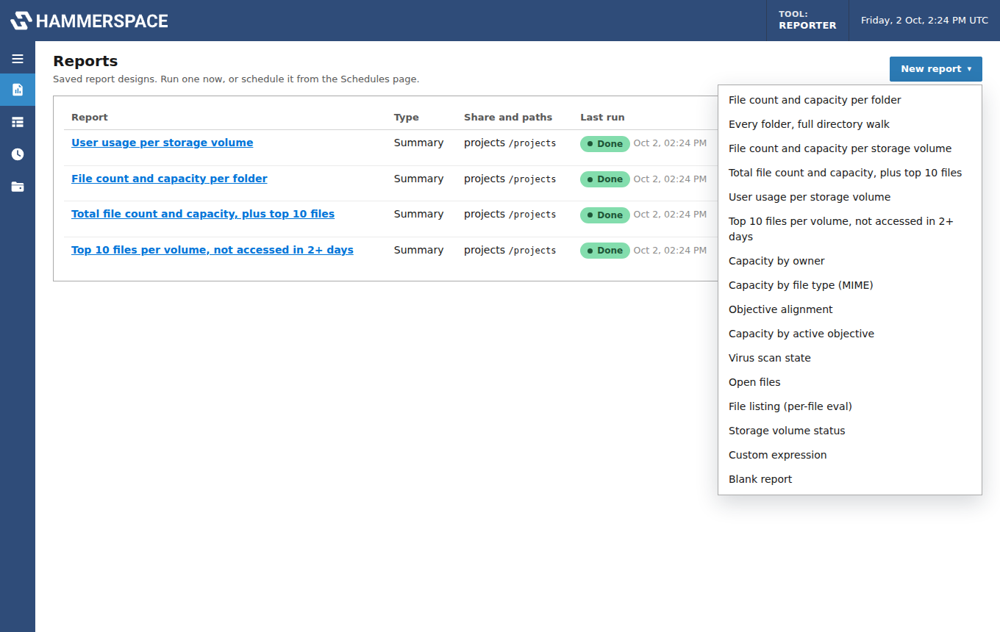

# Hammerspace Reporter

A containerized web service for filesystem reporting on Hammerspace shares. Pick a share,
choose a report, and it builds the HammerScript, runs it with the
[Hammerspace Toolkit (hstk)](https://github.com/hammer-space/hstk) `hs sum` and `hs eval`
commands, and shows the results as sortable tables you can download as CSV, JSON or
Prometheus metrics. Reports run on demand or on a schedule.


## Features

- **Ready-made reports**: capacity per folder, per storage volume, per user per volume,
  totals with the largest files, files not accessed in N days, owner, MIME type, objective
  alignment, virus scan state, open files, file listings and volume status.
- **Report designer**: group by owner, group, volume, MIME type, alignment and more; choose
  metrics (files, space used, logical size, top 10/100 files); filter by size, access age,
  open, online or error state; break results down per folder to any depth.
- **Editable HammerScript**: the generated expression is shown and editable before and after
  a run, with the `hs` command updating as you type.
- **Output you control**: pick and order columns, sort, limit rows, and show every size in one
  unit (bytes, KB, MB, GB or TB).
- **Analysis-friendly exports**: flat CSVs with plain values for spreadsheets, a per-file
  largest-files CSV, Prometheus metrics for per-folder reports, and the raw `hs` output.
- **Objective planning**: model share objectives before applying them. Scan only the
  metadata your conditions use, load the cluster's volumes, groups and objectives, build
  conditions with dropdowns or by hand, and see the space each volume would need, with
  instance counts, coverage warnings and the commands to apply the plan.
- **Crawl speed**: pace each report (commands at once, pause between commands, folder
  listings per second) and cap `hs` commands server-wide, to protect the cluster.
- **Schedules**: cron-based runs with retention and CSV exports that build a history file
  for trend analysis.
- **Share management**: the container mounts NFS or SMB shares itself, or uses shares
  already mounted on the host; it detects and recovers stale mounts.

## Quick start

Requirements: Docker with Compose, and network access to a Hammerspace cluster
(Hammerspace 4.6.5 or later for the current hstk).

```bash
git clone https://github.com/<you>/hs-reporter.git
cd hs-reporter
# edit docker-compose.yml: set HSR_USER / HSR_PASSWORD and TZ
docker compose up -d --build
```

Open <http://localhost:8080> and sign in. Then:

1. **Shares** → **Add share**: enter the Hammerspace server and export (NFS) or share name
   (SMB), and mount it.
2. **Reports** → **New report**: pick a report, choose the folders to scan, adjust options,
   and **Run**.
3. Download results from the **Download** menu, or schedule the report under **Schedules**.

On a Mac, see [Running on a Mac](docs/troubleshooting.md#running-on-a-mac) first.

## Documentation

| Guide | What's in it |
|---|---|
| [User guide](docs/user-guide.md) | Reports, the designer, editing HammerScript, results, exports, schedules |
| [Objective planning](docs/objective-planning.md) | Modeling objectives: scans, conditions, the placement model, space per volume |
| [Shares and mounting](docs/shares.md) | NFS and SMB options, host-mounted shares, how hstk reaches the cluster |
| [Configuration](docs/configuration.md) | Environment variables, sign-in, Docker settings, data and backups |
| [API](docs/api.md) | The JSON API behind the GUI, with examples |
| [Troubleshooting](docs/troubleshooting.md) | Mount errors, stale file handles, running on a Mac |
| [Development](docs/development.md) | Project layout, running locally and tests without a cluster |

## Screenshots

| | |
|---|---|
|  |  |
| New report: the default reports | Designer with editable HammerScript |
|  |  |
| Per-folder capacity in one size unit | Analysis CSV options with a live preview |
|  |  |
| Objective planning: scopes and conditions | Projected space per volume |

## How it works

The service is a FastAPI app with a single-page web GUI, running in one container that has
hstk installed. hstk sends HammerScript to Hammerspace through a special file on the mounted
share, so every report runs against a real Hammerspace mount: the container mounts NFS or SMB
shares itself (this needs the `SYS_ADMIN` capability) or uses shares mounted on the host.
Saved reports, schedules and results are stored as JSON under the `/data` volume.

## License

See [LICENSE](LICENSE).
