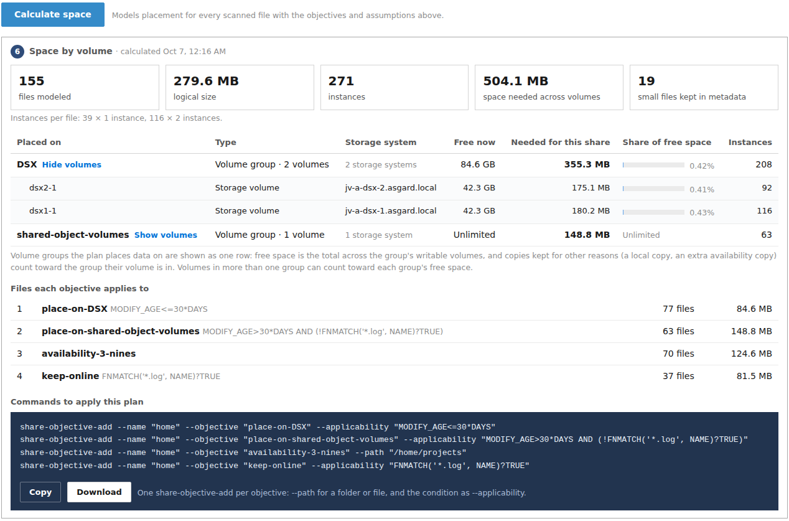
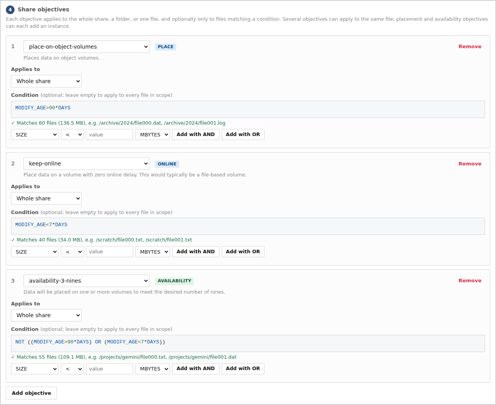
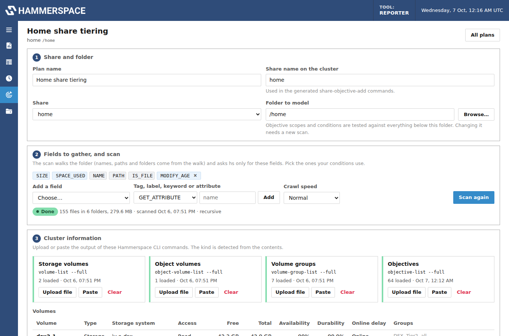
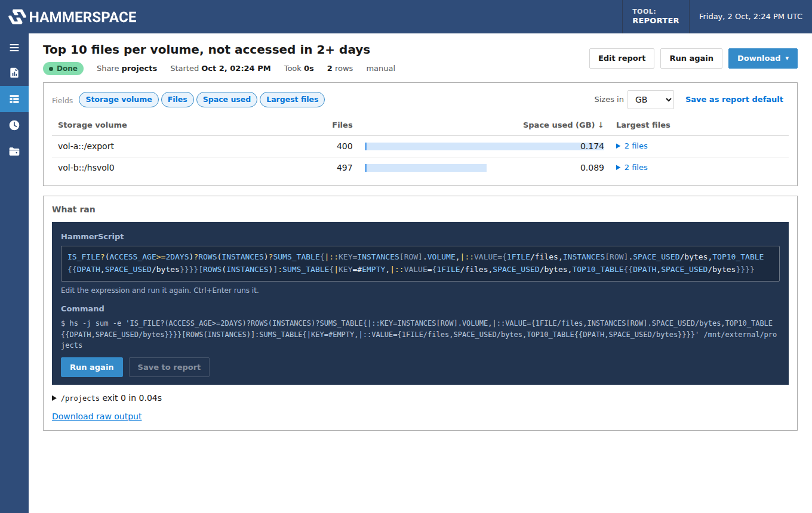
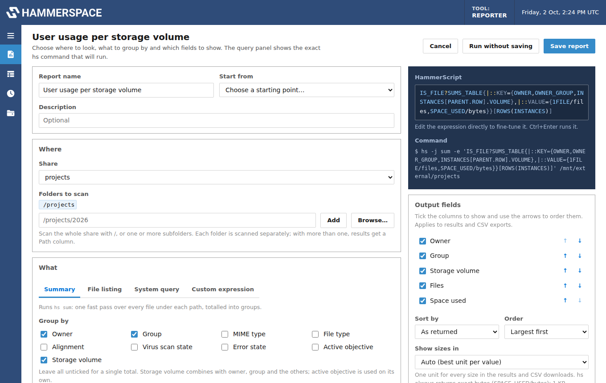
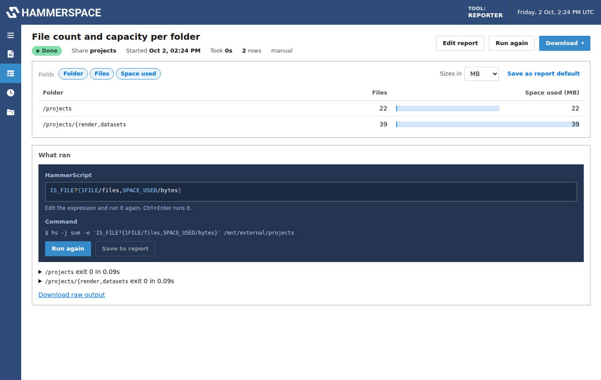
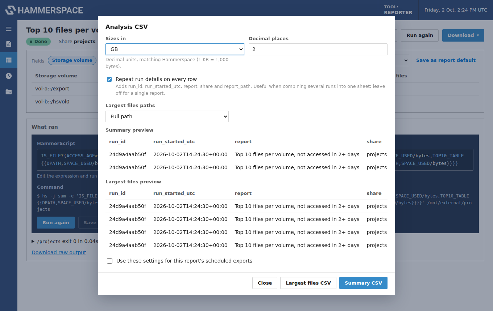

# Hammerspace Reporter

A containerized web service for Hammerspace administrators, with two jobs:

- **Reporting.** Pick a share, choose a report, and it builds the HammerScript, runs it with the
  [Hammerspace Toolkit (hstk)](https://github.com/hammer-space/hstk) `hs sum` and `hs eval`
  commands, and shows the results as sortable tables you can download as CSV, JSON or
  Prometheus metrics. Reports run on demand or on a schedule.
- **Objective planning.** Before you apply objectives to a share, model them: scan the share for
  the metadata your conditions use, load the cluster's volumes, volume groups and objectives,
  and see which files each objective would apply to, where the data would be placed, how many
  instances it creates, and how much space each volume group or volume would need. Then copy
  the `share-objective-add` commands that apply the plan.



## Features

### Reporting

- **Ready-made reports**: capacity per folder, per storage volume, per user per volume, totals
  with the largest files, files not accessed in N days, owner, MIME type, objective alignment,
  virus scan state, open files, file listings and volume status.
- **Report designer**: group by owner, group, volume, MIME type, alignment and more; choose
  metrics (files, space used, logical size, top 10/100 files); filter by size, access age,
  open, online or error state; break results down per folder to any depth.
- **Editable HammerScript**: the generated expression is shown and editable before and after a
  run, with the `hs` command updating as you type.
- **Output you control**: pick and order columns, sort, limit rows, and show every size in one
  unit (bytes, KB, MB, GB or TB).
- **Analysis-friendly exports**: flat CSVs with plain values for spreadsheets, a per-file
  largest-files CSV, Prometheus metrics for per-folder reports, and the raw `hs` output.
- **Schedules**: cron-based runs with retention and CSV exports that build a history file for
  trend analysis.

### Objective planning

- **Targeted scans**: gathers only the metadata fields your conditions need (most designs use
  one to five), such as `MODIFY_AGE`, `LAST_USE_AGE`, `SIZE`, `OWNER`, `IS_ONLINE`, tags,
  labels, keywords and attributes. Folder names and paths come from walking the share.
- **Cluster information from the API or the CLI**: load volumes, volume groups and objectives
  straight from the Hammerspace management API, or upload or paste `volume-list --full`,
  `object-volume-list --full`, `volume-group-list --full` and `objective-list --full`.
  Read-only volumes, failure domains, availability, durability and online delay are picked up
  automatically.
- **Share objectives with scopes and conditions**: apply each objective to the whole share, a
  folder or one file, optionally with a condition. Build conditions from dropdowns or type them;
  they're checked as you type and show how many scanned files they match. File names and paths
  match with `FNMATCH('*.log', NAME)?TRUE` and `!FNMATCH('*/scratch/*', PATH)?TRUE`.
- **Space by placement target**: models place-on, confine-to, exclude-from, keep-online,
  optimize-for-capacity and performance objectives, adds availability and durability copies on
  separate storage systems, keeps files under 40 bytes in metadata on object volumes, and never
  targets read-only volumes. A targeted volume group shows as one row, with free space totalled
  across its volumes.
- **Coverage warnings**: if some files aren't targeted by any placement objective, the plan
  lists them and suggests a catch-all condition, such as
  `NOT ((MODIFY_AGE>90*DAYS) OR (MODIFY_AGE<7*DAYS))`, that you can add in one click. It also
  warns about objectives that can't be satisfied and targets that would run out of space.
- **Commands to apply it**: one `share-objective-add` per objective, with `--path` for folder
  and file scopes and the condition as `--applicability`.

### Both

- **Settings page** for global configuration: crawl speed (Normal, Gentle, Slowest or Custom)
  for every report, schedule and scan, server-wide limits such as a cap on `hs` commands at
  once, default NFS and SMB mount options, and the sign-in password. Changes apply without a
  restart.
- **Share management**: import shares from the cluster (through its management API, or from
  `share-list` output) over NFS, SMB or both, or add them one by one. The container mounts NFS or SMB shares itself, or uses shares
  already mounted on the host, and detects and recovers stale mounts.
- **A console-style GUI** with Hammerspace's look, optional sign-in, and a JSON API for
  everything the GUI does.

## Quick start

Requirements: Docker with Compose, and network access to a Hammerspace cluster
(Hammerspace 4.6.5 or later for the current hstk).

```bash
git clone https://github.com/<you>/hs-reporter.git
cd hs-reporter
# edit docker-compose.yml: set HSR_USER / HSR_PASSWORD and TZ
docker compose up -d --build
```

Open <http://localhost:8080> and sign in, then add shares: **Shares** → **Import from cluster**
and paste the output of the cluster's `share-list` command, or **Add share** to enter one by
hand. If NFS mounts are refused, see [Privileged ports](docs/shares.md#importing-shares-from-the-cluster).

**To run a report:**

1. **Reports** → **New report**: pick a report, choose the folders to scan, adjust the options.
2. **Run** it, then download the results from the **Download** menu, or schedule it under
   **Schedules**.

**To plan objectives:**

1. **Objectives** → **New plan**: choose the share and the folder to model.
2. Pick the fields your conditions will use, and **Scan**.
3. **Load all from the cluster API**, or load the four CLI exports.
4. Add share objectives with scopes and conditions.
5. **Calculate space**, review the warnings, and copy the commands.

On a Mac, see [Running on a Mac](docs/troubleshooting.md#running-on-a-mac) first.

## Screenshots

| | |
|---|---|
|  |  |
| Share objectives: scopes, conditions and the condition builder | An objective plan: share, fields and scan, cluster information |
|  |  |
| Report results in one size unit | Report designer with editable HammerScript |
|  |  |
| Per-folder capacity | Analysis CSV options with a live preview |

## Documentation

| Guide | What's in it |
|---|---|
| [User guide](docs/user-guide.md) | Reports, the designer, editing HammerScript, results, exports, schedules |
| [Objective planning](docs/objective-planning.md) | Scans, conditions, the placement model, space by target, warnings, commands |
| [Shares and mounting](docs/shares.md) | NFS and SMB options, host-mounted shares, how hstk reaches the cluster |
| [Configuration](docs/configuration.md) | The Settings page (crawl speed, limits, mount defaults), environment variables, sign-in, data |
| [API](docs/api.md) | The JSON API behind the GUI, with examples |
| [Troubleshooting](docs/troubleshooting.md) | Mount errors, stale file handles, running on a Mac |
| [Development](docs/development.md) | Project layout, running locally and tests without a cluster |
| [Changelog](CHANGELOG.md) | What changed in each release |

## How it works

The service is a FastAPI app with a single-page web GUI, running in one container that has
hstk installed. hstk sends HammerScript to Hammerspace through a special file on the mounted
share, so everything runs against a real Hammerspace mount: the container mounts NFS or SMB
shares itself (this needs the `SYS_ADMIN` capability) or uses shares mounted on the host.

Reports send a generated expression to `hs sum` or `hs eval` and parse what Hammerspace
returns. Objective planning walks the chosen folder for names and paths, then asks `hs eval`
for only the selected fields, as a tuple that starts with `DPATH`: one recursive call where
possible, with batched per-file calls as a fallback. It then evaluates each objective's
condition against every file and models placement from the uploaded cluster information.

The placement model is an estimate of Hammerspace's behaviour, not the cluster's own engine.
Its assumptions are listed in the [objective planning guide](docs/objective-planning.md#how-space-is-calculated)
and shown in the app.

Saved reports, plans, schedules and results are stored as JSON under the `/data` volume.

## Development

The test suite runs without a cluster, using a stand-in for the `hs` command and real CLI
exports as fixtures:

```bash
pip install -r requirements.txt -r requirements-dev.txt
pytest
```

See [Development](docs/development.md) for the project layout and running the app locally.

## License

See [LICENSE](LICENSE).
