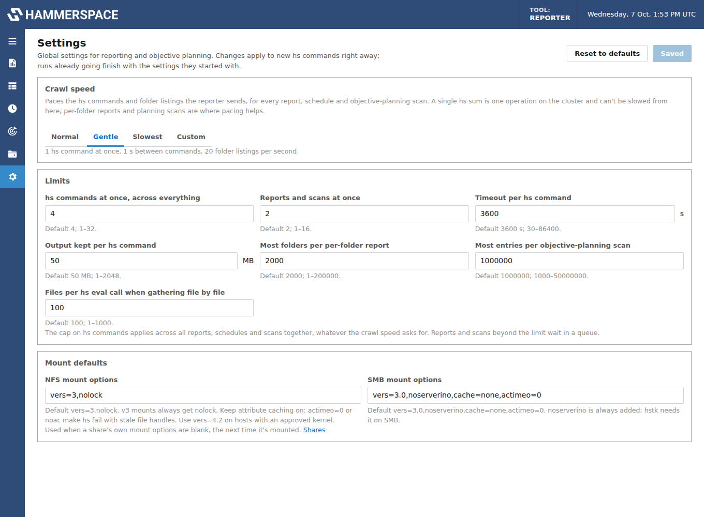

# Configuration

There are two kinds of configuration:

- **The Settings page** (gear icon in the left rail) holds the global settings for reporting
  and objective planning: crawl speed, limits and mount defaults. Changes apply right away,
  without a restart.
- **Environment variables** in `docker-compose.yml` set things the container needs at start
  (sign-in, time zone, paths), and the initial values of the Settings page.

## Settings page



### Crawl speed

Paces the `hs` commands and folder listings the reporter sends, for every report, schedule
and objective-planning scan:

| Speed | hs commands at once | Pause between commands | Folder listings per second |
|---|---|---|---|
| **Normal** | 4 | none | not limited |
| **Gentle** | 1 | 1 s | 20 |
| **Slowest** | 1 | 5 s | 5 |
| **Custom** | 1–16 | 0–3600 s | 0 (no limit) to 1000 |

Choosing **Custom** starts from the values of the speed that was selected. Where pacing
helps:

- **Per-folder reports** list folders over the mount and send one `hs sum` per folder.
  Slower speeds spread that over more time, with fewer commands at once and gaps between them.
- **Objective-planning scans** walk the folder and, when the recursive evaluation isn't
  available, gather metadata in batches of files; both are paced.
- **Reports on several folders** run one folder at a time, with the pause between them.
- **A single `hs sum`** is one operation that the cluster carries out itself; it can't be
  slowed from outside. To split a large scan into smaller pieces, break it down by folder.

The report designer and plan pages show the speed in effect, with a link to this page.

### Limits

| Setting | Default | Range | Purpose |
|---|---|---|---|
| hs commands at once, across everything | 4 | 1–32 | Hard cap for all reports, schedules and scans together, whatever the crawl speed asks for |
| Reports and scans at once | 2 | 1–16 | Others wait in a queue |
| Timeout per hs command | 3600 s | 30–86400 | A command running longer is stopped |
| Output kept per hs command | 50 MB | 1–2048 | Output beyond this is cut off and marked truncated |
| Most folders per per-folder report | 2000 | 1–200000 | Deeper folders are skipped, with a note |
| Most entries per objective-planning scan | 1000000 | 1000–50000000 | Files and folders a scan records |
| Files per hs eval call when gathering file by file | 100 | 1–1000 | Batch size for a scan's per-file fallback |

Changing a limit also releases or holds back work already queued, within a second.

### Mount defaults

The NFS (`vers=3,nolock`) and SMB (`vers=3.0,noserverino,cache=none,actimeo=0`) options used
when a share's own mount options are blank, the next time it's mounted. See
[Shares and mounting](shares.md) for why these defaults.

### How settings are stored

Settings changed on the page are saved in `/data/settings.json`, which holds only the values
that differ from the defaults. **Reset to defaults** removes it. Anything not changed on the
page follows the environment variables below, so they still work as before.

## Environment variables

| Variable | Default | Purpose |
|---|---|---|
| `HSR_USER`, `HSR_PASSWORD` | unset | Sign-in for the GUI and API (HTTP Basic). Unset turns sign-in off |
| `TZ` | `UTC` | Time zone for schedules |
| `HSR_DATA_DIR` | `/data` | Where shares, reports, plans, schedules, results, exports and settings are stored |
| `HSR_MOUNT_ROOT` | `/mnt/hs` | Where the container mounts NFS and SMB shares |
| `HSR_LOCAL_ROOT` | `/mnt/external` | The only place "Already mounted" shares may point |
| `HSR_HS_BIN` | `hs` | The hstk command |

Initial values for the Settings page (used until changed there):

| Variable | Setting |
|---|---|
| `HSR_CRAWL_SPEED` | Crawl speed: `normal`, `gentle`, `slowest` or `custom` |
| `HSR_FOLDER_CONCURRENCY`, `HSR_COMMAND_PAUSE`, `HSR_LIST_RATE` | Custom crawl speed values; setting any of them starts with Custom selected |
| `HSR_MAX_HS_PROCESSES` | hs commands at once, across everything |
| `HSR_MAX_CONCURRENT` | Reports and scans at once |
| `HSR_RUN_TIMEOUT` | Timeout per hs command (seconds) |
| `HSR_MAX_OUTPUT_MB` | Output kept per hs command |
| `HSR_MAX_FOLDERS` | Most folders per per-folder report |
| `HSR_PLAN_MAX_FILES` | Most entries per objective-planning scan |
| `HSR_PLAN_BATCH` | Files per hs eval call when gathering file by file |
| `HSR_NFS_OPTIONS`, `HSR_SMB_OPTIONS` | Mount defaults |

## Sign-in

With `HSR_USER` and `HSR_PASSWORD` set, the browser asks for them, and API calls need HTTP
Basic credentials. `/api/health` stays open for health checks. Put the service behind HTTPS
(for example a reverse proxy) if it's reachable beyond a trusted network.

## hstk version

The image installs hstk from PyPI. To pin a version or build from source:

```bash
docker compose build --build-arg HSTK_SPEC="hstk==4.6.6.1"
docker compose build --build-arg HSTK_SPEC="git+https://github.com/hammer-space/hstk.git@master"
```

hstk 4.6.6 and later need Hammerspace 4.6.5 or later.

## Container privileges

Mounting NFS or SMB inside the container needs the `SYS_ADMIN` and `DAC_READ_SEARCH`
capabilities and AppArmor unconfined, as in the provided compose file. If mounts still fail
with "permission denied", use `privileged: true`. To avoid mount privileges entirely, mount
shares on the host instead ([Shares and mounting](shares.md#shares-mounted-on-the-host)).

## Data and backups

Everything the service keeps is under `/data` (the `hsr-data` volume):

| Path | Contents |
|---|---|
| `shares.json` | Share definitions, including SMB passwords (file mode 0600) |
| `creds/` | SMB credentials files (0600) |
| `definitions.json` | Saved reports |
| `plans.json`, `plans/` | Objective plans and their scans |
| `settings.json` | Settings changed on the Settings page |
| `schedules.json` | Schedules |
| `runs/` | One file per result, including the raw `hs` output |
| `exports/` | Scheduled CSV exports and history files |

Back up the volume to keep reports and history; protect it, since it holds SMB passwords.

## Scaling

The scheduler and run queue live in the one process, so run a single container with one
worker. Don't run several replicas against the same `/data`.
