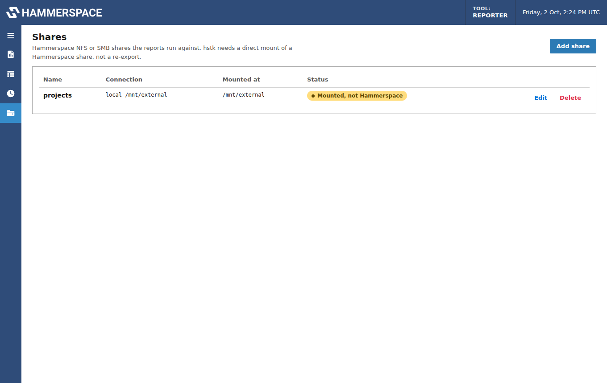

# Shares and mounting

hstk sends HammerScript to the cluster by writing to a special gateway file
(`.fs_command_gateway`) on a mounted Hammerspace share and reading the results back. Every
report therefore runs against a **direct mount of a Hammerspace share**: not a copy, and not
a re-export through another server. The Shares page warns "Mounted, not Hammerspace" when a
mount doesn't have the gateway.



## Connection types

| Type | What the container does | Container needs |
|---|---|---|
| **NFS v3** | `mount -t nfs -o vers=3,nolock server:/export /mnt/hs/<id>` | `SYS_ADMIN` capability and AppArmor unconfined, or `privileged: true` |
| **SMB** | `mount -t cifs -o vers=3.0,noserverino,cache=none,actimeo=0` with a credentials file | same as NFS |
| **Already mounted** | Uses a path you mounted on the Docker host and bound under `/mnt/external` | nothing extra |

Leave a share's **Mount options** blank to use the defaults, set container-wide with
`HSR_NFS_OPTIONS` and `HSR_SMB_OPTIONS` (see [Configuration](configuration.md)), or enter
options for that share.

**Mount when the service starts** remounts the share after a restart.

## NFS

- The default is **NFSv3** (`vers=3,nolock`). Hammerspace allows NFS 4.2 only from approved
  Linux client kernels, and a container uses its host's kernel, which may not be approved
  (a Docker Desktop or Colima VM on a Mac never is). On a Linux host with an approved
  kernel you can use `vers=4.2` instead.
- `nolock` is added to every v3 mount, since the container doesn't run the NFS lock service
  and reporting never needs locks.
- **Keep attribute caching on.** With `actimeo=0` or `noac`, reading hstk's results over
  NFSv3 fails with "Stale file handle".
- If the export requires connections from privileged (low-numbered) source ports and the
  container's traffic is translated (as on a Mac), mounts fail with "access denied by
  server". Allow non-privileged ports on that export.

## SMB

- The default options are `vers=3.0,noserverino,cache=none,actimeo=0`.
- `noserverino` is required: hstk's gateway file gets a new server-side ID between hstk
  writing the command and reading the results, and without `noserverino` the Linux SMB client
  rejects the second open as a stale file handle. It's added even if you set your own options.
- The username, password and domain are written to a credentials file readable only by root.
  Use an account with read access for reporting.

## Shares mounted on the host

If you'd rather not give the container mount privileges:

1. Mount the share on the Docker host (NFS or SMB, using the notes above).
2. Bind it into the container under `/mnt/external` in `docker-compose.yml`:

   ```yaml
   volumes:
     - type: bind
       source: /mnt/hammerspace
       target: /mnt/external
       bind: { propagation: rslave }
   ```

3. Remove the `cap_add` and `security_opt` sections.
4. Add a share of type **Already mounted** with a path such as `/mnt/external/projects`.

`rslave` lets mounts made on the host after the container starts show up inside it.

## Stale mounts

If a mount stops responding (after a laptop sleeps, a network change or a failover), the
Shares page shows it as **Stale** with a **Remount** button. Report runs that hit a stale
file handle remount the share and retry once automatically.
