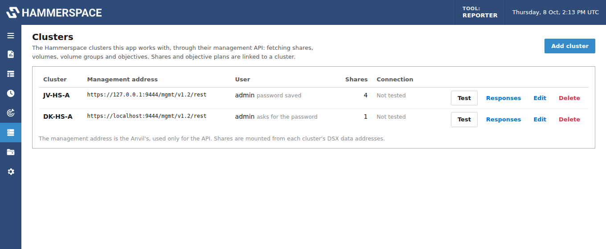

# Clusters and shares

hstk sends HammerScript to the cluster by writing to a special gateway file
(`.fs_command_gateway`) on a mounted Hammerspace share and reading the results back. Every
report therefore runs against a **direct mount of a Hammerspace share**: not a copy, and not
a re-export through another server. The Shares page warns "Mounted, not Hammerspace" when a
mount doesn't have the gateway.


## Clusters

The app can work with several Hammerspace clusters at once. Each is added on the **Clusters**
page (in the left rail, above Shares):



- **Name**, and the cluster's **management address** (the Anvil's IP or FQDN), **port** (8443)
  and **API path** (`/mgmt/v1.2/rest`), used only for its management API.
- **Username** and **password**. With **Save the password** off, you're asked for it each time
  that cluster's data is fetched. Saved passwords are kept in `/data/clusters.json`, readable
  only by the service. Use an account that can read the cluster's configuration.
- **Verify the cluster's TLS certificate**: off by default, since clusters usually have a
  self-signed certificate.
- **Test** logs in and reads the cluster's name. **Responses** downloads the last raw responses
  from that cluster, for troubleshooting.

Shares and objective plans are linked to a cluster. The Shares page groups shares by cluster,
and wherever a share is shown or chosen (reports, results, plans) its cluster is shown too, so
shares with the same name on different clusters stay distinct. Removing a cluster keeps its
shares, no longer linked to a cluster.

Crawl speed and the limits on the Settings page are global: they cover all clusters together.

## Importing shares from the cluster

**Shares → Import from cluster** adds shares from the cluster's own list:

1. Choose the **cluster**, then click **Fetch shares** to read the list from its management API,
   or run `share-list` on that cluster and upload or paste its output. (Pasted output can also
   be imported without linking it to a cluster.)
2. Choose the address to **mount from**: a DSX data address (see below). Fetching through the
   API fills it in; otherwise **Find DSX data addresses** looks them up. Choose **NFS**, **SMB**
   or both. With both, each share is added twice, as "name (NFS)" and "name (SMB)". SMB needs a
   username and password.
3. Tick the shares to add. Published shares are ticked to start with; the root share (`/`)
   isn't offered, since reports and plans work inside a share.

NFS shares use the share's path as the export (`/stowerstiertest`) and SMB shares use its name
(`stowerstiertest`). Imported shares are linked to the cluster and remember their name on it,
which becomes the default share name in objective plans' commands. Shares already set up from
the same cluster (or the same server) with the same export are skipped. You can mount them right away and have them mounted when the service starts.

**Mount from a DSX data address, not the Anvil.** Shares are served from the DSX nodes'
data interfaces. A cluster's management address (the Anvil, which its API uses) is
the wrong place to mount from, even where its interface also has the DATA role. Use an address
on a **DSX** node's interface with the **DATA** role. The cluster API's `/network-interfaces`
lists them; the import and the **Add share** form offer them as suggestions (**Find DSX data
addresses**), and warn when the address entered is the Anvil's. Shares set up with their cluster's
management address are labeled **Anvil address** on the Shares page (shares not linked to a
cluster are checked against every cluster): edit them and change the server to a DSX data
address.

**Privileged ports.** A share whose export options all say `Insecure: false` only accepts NFS
connections from privileged (low-numbered) source ports. The machine running this app may
connect from other ports, for example through Docker's networking on a Mac, and the cluster
then refuses the mount with "access denied". The import flags these shares and reminds you to
either **enable insecure ports on the share's export**, or **add an export rule for the machine
running this app** (the IP address the cluster sees it connect from) that allows insecure ports.
A failed NFS mount with "access denied" repeats the reminder.

## Connection types

| Type | What the container does | Container needs |
|---|---|---|
| **NFS v3** | `mount -t nfs -o vers=3,nolock server:/export /mnt/hs/<id>` | `SYS_ADMIN` capability and AppArmor unconfined, or `privileged: true` |
| **SMB** | `mount -t cifs -o vers=3.0,noserverino,cache=none,actimeo=0` with a credentials file | same as NFS |
| **Already mounted** | Uses a path you mounted on the Docker host and bound under `/mnt/external` | nothing extra |

A share's **Cluster** links it to one of the clusters on the Clusters page. Leave a share's **Mount options** blank to use the defaults, set container-wide with
the mount defaults on the [Settings page](configuration.md#mount-defaults), or enter
options for that share.

**Mount when the service starts** remounts the share after a restart.

## NFS

- The default is **NFSv3** (`vers=3,nolock`). Hammerspace allows NFS 4.2 only from approved
  Linux client kernels, and a container uses its host's kernel, which may not be approved
  (a Docker Desktop or Colima VM on a Mac never is). On a Linux host with an approved
  kernel you can use `vers=4.2` instead.
- `nolock` is added to every v3 mount, since the container doesn't run the NFS lock service
  and reporting never needs locks.
- **Keep attribute caching on.** With `actimeo=0` or `noac`, reading hstk's results over
  NFSv3 fails with "Stale file handle".
- If the export requires connections from privileged (low-numbered) source ports and the
  container's traffic is translated (as on a Mac), mounts fail with "access denied by
  server". Allow non-privileged ports on that export.

## SMB

- The default options are `vers=3.0,noserverino,cache=none,actimeo=0`.
- `noserverino` is required: hstk's gateway file gets a new server-side ID between hstk
  writing the command and reading the results, and without `noserverino` the Linux SMB client
  rejects the second open as a stale file handle. It's added even if you set your own options.
- The username, password and domain are written to a credentials file readable only by root.
  Use an account with read access for reporting.

## Shares mounted on the host

If you'd rather not give the container mount privileges:

1. Mount the share on the Docker host (NFS or SMB, using the notes above).
2. Bind it into the container under `/mnt/external` in `docker-compose.yml`:

   ```yaml
   volumes:
     - type: bind
       source: /mnt/hammerspace
       target: /mnt/external
       bind: { propagation: rslave }
   ```

3. Remove the `cap_add` and `security_opt` sections.
4. Add a share of type **Already mounted** with a path such as `/mnt/external/projects`.

`rslave` lets mounts made on the host after the container starts show up inside it.

## Stale mounts

If a mount stops responding (after a laptop sleeps, a network change or a failover), the
Shares page shows it as **Stale** with a **Remount** button. Report runs that hit a stale
file handle remount the share and retry once automatically.
