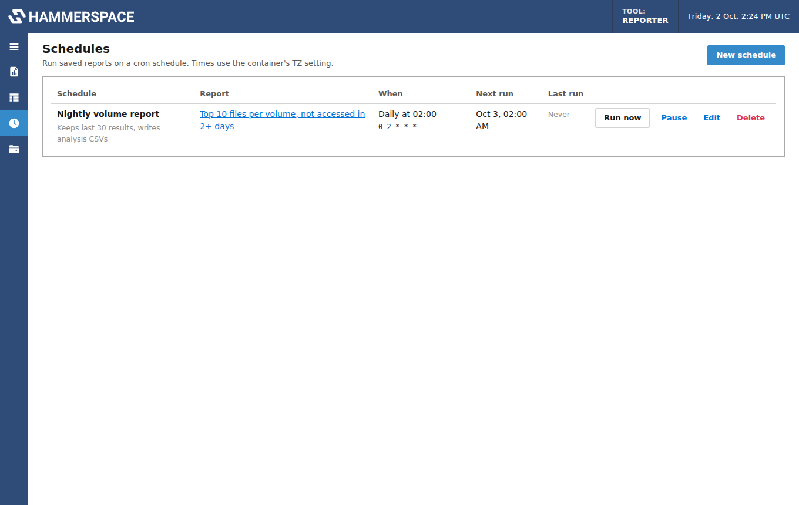

# User guide

- [Reports](#reports)
- [The report designer](#the-report-designer)
- [Editing the HammerScript](#editing-the-hammerscript)
- [Results](#results)
- [Downloads and exports](#downloads-and-exports)
- [Schedules](#schedules)

## Reports

**Reports → New report** lists the default reports. Pick one to open it in the designer with
its options filled in, or choose **Custom expression** or **Blank report**.


| Report | What it runs |
|---|---|
| File count and capacity per folder | `IS_FILE?{1FILE/files,SPACE_USED/bytes}` once per folder, one level deep |
| Every folder, full directory walk | the same, for every folder below the selected path |
| File count and capacity per storage volume | `SUMS_TABLE` keyed on `INSTANCES[ROW].VOLUME` |
| Total file count and capacity, plus top 10 files | totals with `TOP10_TABLE{{DPATH,SPACE_USED/bytes}}` |
| User usage per storage volume | `KEY={OWNER,OWNER_GROUP,INSTANCES[PARENT.ROW].VOLUME}` |
| Top 10 files per volume, not accessed in 2+ days | per volume with top 10, filtered on `ACCESS_AGE>=2DAYS` |
| Capacity by owner | `SUMS_TABLE` keyed on `OWNER`, with the largest files |
| Capacity by file type (MIME) | keyed on `ATTRIBUTES.MIME.STRING` |
| Objective alignment | keyed on `OVERALL_ALIGNMENT` |
| Capacity by active objective | keyed on each `LIST_OBJECTIVES_ACTIVE` entry |
| Virus scan state | keyed on `ATTRIBUTES.VIRUS_SCAN` |
| Open files | totals and largest files, filtered on `IS_OPEN` |
| File listing | `hs eval -r` with one row per file |
| Storage volume status | `hs eval` of each storage volume's name and state |

Saved reports appear on the Reports page with their last run. **Run** starts a run; the
report name opens it for editing.

## The report designer


### Where

- **Share**: one of the shares set up on the Shares page.
- **Folders to scan**: `/` for the whole share, or one or more subfolders. Type a path such as
  `/projects/2026` and press **Add**, or **Browse…**. Paths are checked when added and again
  when the report runs. Each folder is scanned separately; with more than one, results get a
  **Path** column.

### What

Four report types:

- **Summary (`hs sum`)**: one pass over every file under each folder, totalled into groups.
  - *Group by*: Owner, Group, MIME type, File type, Alignment, Virus scan state, Error state
    and Storage volume, in any combination, or Active objective on its own. Leave them all
    unticked for a single total.
  - *Metrics*: Files, Space used, Logical size, and Largest files (top 10 or 100 per group).
    Hammerspace returns exact numbers (`1FILE/files`, `SPACE_USED/bytes`); units are applied
    when results are shown.
  - *Break down by folder*: run the summary once per folder, 1–5 levels or every level below
    each selected folder. The selected folder is the first row, and each folder's totals
    include everything below it. Hidden folders are skipped unless included. Folders are
    scanned in parallel; while it runs, the results page shows how many are done.
- **File listing (`hs eval`)**: one row per file with the fields you pick (path, owner, group,
  space used, size, type, MIME type, alignment, objectives, instances, errors, open state).
  Recursion and "files only" are options. Large trees give large results, so filter first.
- **System query (`hs eval`)**: storage volumes and their status, volume groups, smart
  objectives, collections, and replication, sweep and assimilation details.
- **Custom expression**: any HammerScript for `hs sum` or `hs eval`, with optional column
  names for the values it returns.

### Filters

Summary and file listing reports can be limited to files by minimum or maximum space used,
by access age ("not accessed for at least N days"), to open, online or errored files, and by
any extra HammerScript condition (for example `OWNER!="root"`). **Include non-files** passes
`--nonfiles` to hs.

### Crawl speed

To protect the cluster from load, each report has a crawl speed:

| Setting | hs commands at once | Pause between commands | Folder listings per second |
|---|---|---|---|
| **Normal** | 4 | none | not limited |
| **Gentle** | 1 | 1 s | 20 |
| **Slowest** | 1 | 5 s | 5 |
| **Custom** | 1–16 | 0–3600 s | 0 (no limit) to 1000 |

What these control:

- **Per-folder reports** list folders over the mount (one directory listing per folder) and
  then send one `hs sum` per folder. Slower settings spread that work over more time, with
  fewer commands at once and gaps between them. While a report runs, its page shows the
  folders found so far, then how many have been scanned.
- **Reports on several folders** run one folder at a time, with the pause between them.
- **A single `hs sum`** is one operation on the cluster, which walks the tree itself; it
  can't be slowed down from outside. To split a large scan into smaller pieces, break it
  down by folder and use a slower speed. Note that per-folder totals include everything
  below each folder, so a full directory walk does more total work than one summary of the
  same tree. It's spread out rather than reduced.

Whatever each report asks for, the server runs at most `HSR_MAX_HS_PROCESSES` (default 4)
`hs` commands at once across all reports, and at most `HSR_MAX_CONCURRENT` reports at once.
Schedules are another way to protect the cluster: run heavy reports outside busy hours.

### Output fields

The panel on the right controls what the results show:

- **Columns**: tick the ones to show and order them with the arrows.
- **Sort by** and **Order**, and a **Row limit**.
- **Show sizes in**: Auto (the best unit per value), or one unit for every size: bytes, KB,
  MB, GB or TB. Units are decimal like Hammerspace's (1 KB = 1,000 bytes).

These settings are saved with the report and apply to the results page, downloads and
scheduled exports.

## Editing the HammerScript

The HammerScript panel shows the expression the designer built, and you can edit it directly
for any report. The **Command** below it updates as you type, and Ctrl+Enter (Cmd+Enter on a
Mac) runs it.

- A hand-edited expression is saved with the report and marked **Edited**. The report's
  columns, grouping, per-folder and display settings still apply to the results.
- Once edited, changing the report's options doesn't rewrite your expression. **Reset to
  generated** goes back to the expression built from the options.
- If an edit asks for sizes in one unit, such as `SPACE_USED/gbytes`, the values are converted
  back to bytes so the size-unit setting and exports stay correct.
- Expressions are a single line, as `hs -e` expects; line breaks become spaces.

On a result's page, the expression that ran is editable too:

- **Run edited expression** runs it once without changing the saved report. The run is
  marked "edited HammerScript".
- **Save to report** makes it the report's expression for future runs, including scheduled ones.
- **Undo changes** puts the original back.

## Results


- Toggle columns with the field buttons and sort by clicking a column header.
  **Save as report default** keeps those choices.
- **Sizes in** switches the size unit for the table and the "Table as shown" download.
- Largest-files cells expand to show each file and its size.
- **What ran** shows the expression and each `hs` command with its output and exit code.

Runs that fail show Hammerspace's error message. If a mount went stale during a run, it's
remounted and retried once automatically. Runs interrupted by a service restart are marked
failed.

## Downloads and exports

The **Download** menu on a result offers:

| Download | Contents |
|---|---|
| **Analysis CSV…** | One row per group with plain values, for sorting and pivoting in a spreadsheet |
| **Largest files CSV** (from the same dialog) | One row per file: group, rank, path and size |
| **Table as shown** | The columns, order, sort and size unit on screen |
| **JSON** | The table as shown, as JSON |
| **Prometheus metrics** | Per-folder reports: `node_directory_size_bytes` and `node_directory_file_count` |
| **Raw hs output** | Exactly what Hammerspace returned |

### Analysis CSV options


- **Sizes in**: bytes (whole numbers) or KB, MB, GB or TB with a chosen number of decimal
  places. The column name carries the unit, for example `space_used_gb`.
- **Repeat run details on every row**: adds `run_id`, `run_started_utc`, `report`, `share`
  and `report_path`. Turn it on to combine several runs in one sheet; leave it off for a
  single report.
- **Largest files paths**: full paths, or relative to the report path.
- **Use these settings for this report's scheduled exports**: saves them on the report.

The preview shows the first rows of each file as you change the options.

### Converting hs output you run yourself

`app/hs2csv.py` converts the output of `hs` commands run by hand into the same CSV layout:

```bash
hs -j sum -e 'IS_FILE?SUMS_TABLE{...}' /mnt/share/projects > out.txt
docker exec -i hs-reporter python -m app.hs2csv --path /mnt/share/projects \
    --keys storage_volume --values files,space_used_bytes,largest_files < out.txt > summary.csv
```

Add `--files-out largest-files.csv` for per-file rows. `app/hs2csv.py` and `app/hsparse.py`
also run on their own with Python 3.

## Schedules



**Schedules → New schedule** runs a saved report on a cron schedule (presets for hourly,
daily, weekdays, weekly and monthly, or any 5-field cron expression). Times use the
container's `TZ`.

- **Results to keep**: older scheduled results are deleted beyond this number (0 keeps all).
- **Write analysis CSVs each run**: each run writes its analysis and largest-files CSVs to
  `/data/exports/<schedule-id>/` and appends them to `<report>-history.csv` and
  `<report>-largest-files-history.csv`, which build up a time series. If the report's columns
  change, the old history file is renamed rather than mixed with the new layout. The files are
  listed on the Schedules page.
- **Run now** starts a scheduled run immediately; **Pause** and **Resume** stop and restart it.

If a run is still going when its next time comes, that time is skipped rather than stacked.
